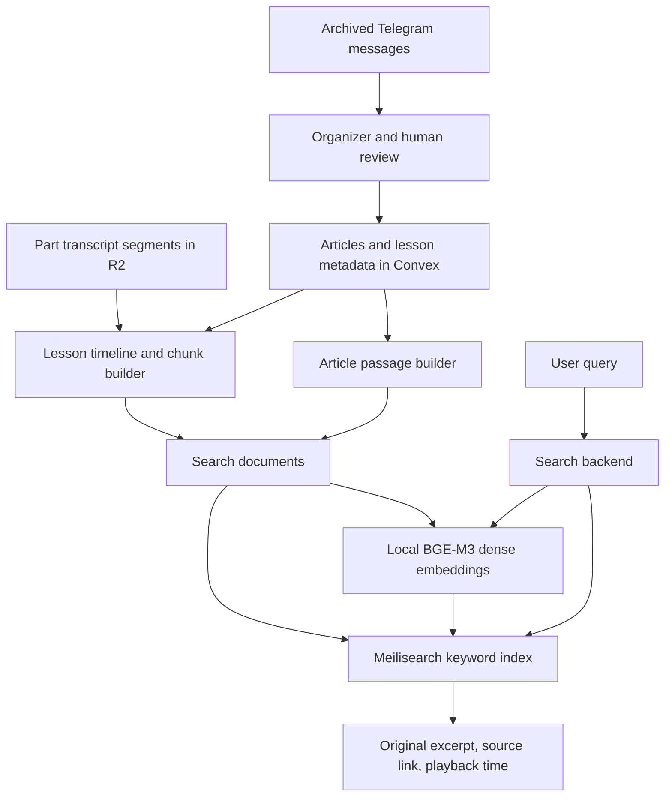

# Search and Content Indexing Plan: Meilisearch + BGE-M3

Date: 2026-09-08

Status: research and implementation proposal; search is not implemented by this document.

Scope: Arabic Telegram articles and lesson transcripts in this repository, with local inference and no paid embedding API.

## 1. Recommendation and the meaning of “free”

**Keep Meilisearch Community Edition. Build keyword search first, then evaluate local BGE-M3 dense embeddings on the same content and queries. Keep hybrid search if it retrieves useful passages that keyword search misses.** This is my recommendation for this archive, not a claim that this combination wins on every dataset.

Meilisearch CE includes keyword and AI search under the MIT license. BGE-M3 also uses the MIT license. Running both on hardware you own avoids software subscription and embedding API fees. Meilisearch Cloud and the Enterprise edition are separate offerings; this plan targets CE. See the [Meilisearch edition documentation](https://www.meilisearch.com/docs/resources/self_hosting/enterprise_edition) and [BGE-M3 model card](https://huggingface.co/BAAI/bge-m3).

| Cost | Proposed approach |
| --- | --- |
| Search software | Self-host Meilisearch CE. |
| Document and query embeddings | Download an open model and run it locally. |
| Initial experiment | Use the existing Mac; do not rent a GPU. |
| Public availability | Requires an available machine, electricity, network access, and storage. A VPS would add a hosting bill. |
| Existing archive | Convex and R2 costs remain separate from search. |

**The whole archive cannot be described as free cloud hosting.** The repository records 117.3 GB in R2; its Standard storage free allowance is 10 GB-month per month. Convex also has plan limits. Those are reasons to measure existing usage, not to migrate the working archive for this search experiment. A strict zero-service-bill installation would need local storage and a local backend as a separate project. See [R2 pricing](https://developers.cloudflare.com/r2/pricing/) and [Convex pricing](https://www.convex.dev/pricing).

## 2. Are other technologies better?

Choose the search engine and the embedding model separately. A better embedding model does not require replacing Meilisearch: regenerate document vectors and query vectors with the new model.

### Search engines

The capabilities below come from the linked documentation; the fit assessments are recommendations for this repository.

| Option | When it fits | Decision here |
| --- | --- | --- |
| **Meilisearch CE + local embeddings** | A searchable website with keyword matching, typo tolerance, filters, and semantic retrieval. | First choice: already in the project plan; one search engine for both retrieval paths. [Features](https://www.meilisearch.com/docs/getting_started/features) |
| **Qdrant + BGE-M3** | Experiments needing dense vectors, learned sparse vectors, or token-level multivectors with late interaction. | Stronger fit if exploiting BGE-M3's full retrieval modes becomes a measured requirement. This requires a different retrieval pipeline; do not run two engines initially. Qdrant uses Apache 2.0. [Repository](https://github.com/qdrant/qdrant), [hybrid queries](https://qdrant.tech/documentation/search/hybrid-queries/) |
| **PostgreSQL + pgvector + full-text search** | An application already using PostgreSQL and wanting search beside its data. | Free software, but adds a database to this Convex project. Arabic analysis, typo handling, and result fusion need deliberate implementation. [pgvector hybrid search](https://github.com/pgvector/pgvector#hybrid-search) |
| **Convex native search** | Reusing the existing backend's full-text and vector indexes. | Worth a small baseline if avoiding a search process matters most. Would require storing searchable chunks/vectors in Convex and implementing hybrid orchestration; hosted usage has quotas. [Search documentation](https://docs.convex.dev/search/overview) |
| **SQLite FTS5** | A small local keyword-search utility with minimal operations. | The cheapest operational baseline. FTS5 itself does not provide semantic vector search; adding that is extra work. [FTS5 documentation](https://www.sqlite.org/fts5.html) |

Meilisearch keyword ranking is its own ordered ranking system. Calling the proposed combination “BM25 + BGE-M3” would be inaccurate. The baseline is **Meilisearch keyword ranking + BGE-M3 dense retrieval**. See [ranking rules](https://www.meilisearch.com/docs/capabilities/full_text_search/relevancy/ranking_rules).

### Embedding models to compare

| Model | License | Dense dimensions / input limit | Role in the experiment |
| --- | --- | --- | --- |
| **BAAI/bge-m3** | MIT | 1024 / 8192 tokens | Reference candidate; multilingual, with dense, sparse, and multivector outputs. Use dense output first. [Model card](https://huggingface.co/BAAI/bge-m3) |
| **intfloat/multilingual-e5-small** | MIT | 384 / 512 tokens | Candidate when CPU latency or memory matters most. Requires `query: ` and `passage: ` prefixes, including for Arabic. [Model card](https://huggingface.co/intfloat/multilingual-e5-small/raw/main/README.md) |
| **Qwen/Qwen3-Embedding-0.6B** | Apache 2.0 | Up to 1024 / 32K tokens | Alternative to benchmark for quality. Supports reduced output dimensions; use the documented query instruction and pooling. Its newer release does not establish superiority on these transcripts. [Model card](https://huggingface.co/Qwen/Qwen3-Embedding-0.6B) |

Start with BGE-M3. Test E5-small if local query inference is too slow, and Qwen3-Embedding-0.6B as a quality challenger. Neither alternative has been benchmarked on this archive. Do not choose from an English or multilingual leaderboard score alone.

Meilisearch's support for several vectors per document does **not** imply ColBERT-style token matching. Its `userProvided` integration accepts document embeddings; BGE-M3 sparse token weights and ColBERT outputs need a retrieval path designed for them. See [user-provided embeddings](https://www.meilisearch.com/docs/capabilities/hybrid_search/how_to/search_with_user_provided_embeddings) and [Qdrant vector types](https://qdrant.tech/documentation/manage-data/vectors/).

## 3. Starting point in this repository

The [main plan](telegram_archive_plan.md) already defines M4 keyword search and optional M4.5 hybrid search. This document details those stages and proposes corrections to a few assumptions. It does not rewrite the frozen baseline.

From the repository files, rather than a new live deployment audit:

- [The task ledger](tasks.md) records 26,723 archived messages and 9,793 audio binaries covering 2,926.6 hours. It still lists the transcription campaign as incomplete. Confirm current coverage before estimating indexing work.
- [The schema](../convex/schema.ts) already has `articles`, `lessons`, `lessonParts`, `lessonSources`, `indexedAt`, and `indexVersion`. Organizer and search tasks remain unchecked.
- [Transcript artifacts](../src/archive/transcribe.py) retain `segments` and provenance. They no longer require duplicate `transcript`, `words`, or `cues` fields.
- [The glossary module](../src/archive/glossary.py) has spelling normalization and a `meili_synonyms()` exporter. Reuse this work after reconciling its normalization rules with the search contract.
- [The pipeline harness](../src/archive/pipeline.py) already handles stage locks and run history. Reuse it for indexing and embedding batches.

The sample experiment can start from completed transcripts. Full search coverage depends on completing transcription and organizing the eligible content.

## 4. Organize content before indexing

Keep ownership of data clear:

| Layer | Contents |
| --- | --- |
| Convex | Source identity, articles, lesson composition, titles, series, review decisions, source links, and processing state. |
| Private R2 | Original media, Telegram exports, and transcript artifacts. |
| Meilisearch | Rebuildable search documents, copied metadata, and vectors. |
| Local embedding process | One loaded model for batch and query inference. |



Use **channel → series → lesson → ordered part → passage** for audio, and **channel → article → passage** for text. Channel identifies a source; it must not automatically identify the speaker of forwarded audio. Preserve explicit source attribution and the existing exclusion of forwarded audio from the speaker's lessons.

1. Classify messages as articles, lesson titles, links, notices, or other. Do not index a standalone title as a complete lesson.
2. Group parts using explicit Telegram relationships first: grouped messages, titles, replies, and known source mappings. Use time proximity only as supporting evidence.
3. Preserve stable `lessonKey` values, ordered parts, and `assemblyHash`. Repeated media should reuse its transcript; preserve all source occurrences.
4. Record uncertain grouping as `needs_review`. Exclude uncertain compositions from the default public lesson index; use a separate private preview if needed. Do not treat an uncertain composition as approved.
5. Preserve approved compositions on reruns. Source changes follow the existing review workflow.
6. Start navigation with channel, series, date, and content type. Add human-reviewed topic tags only when those facets prove insufficient. Embeddings do not create a trustworthy subject taxonomy by themselves.

Start with articles and completed audio transcripts. Treat PDF text extraction, image OCR, and the 94 video containers as explicit later coverage decisions. A filename or caption match must not imply that the attachment's contents were indexed.

## 5. Preserve original text; prepare two search representations

| Representation | Purpose | Proposed treatment |
| --- | --- | --- |
| `title`, `text` | Display and source verification | Preserve wording and punctuation; apply only traceable, approved corrections. Keep the original artifact. |
| `normalizedTitle`, `normalizedText` | Keyword indexing and query matching | One versioned Arabic normalization function shared by indexing, queries, glossary preparation, and evaluation. |
| Embedding input | Semantic retrieval | Light Unicode/whitespace cleanup of the original passage, with a short trusted title or series prefix. Preserve negation and wording. |

For the keyword baseline, implement the existing plan's `normVersion` contract: remove tashkeel and tatweel, unify alef variants and digits, fold alef maqsura, and collapse whitespace. Treat its `ة → ه` rule as a recall experiment and measure collisions. The glossary implementation currently folds some additional characters and does not implement the exact same digit contract; do not silently declare the two equivalent.

Use the glossary's structure and reviewed aliases, but normalize both synonym keys and values with the chosen search function. Preserve distinctions between different scholars and books. Do not fuzzy-rewrite ASR text or turn unrelated doctrinal terms into synonyms. Keep negation such as `لا`, `ليس`, and `غير`; begin without a broad Arabic stop-word list.

**Proposed refinement to M4.5:** embed lightly cleaned original text instead of assuming the aggressive keyword form is the best model input. Compare both on the evaluation set. Pin the winning preprocessing and title template with the embedding configuration.

For the first UI, show the original matching passage without word-level highlighting. Offsets from normalized text do not map directly to the original text, and a semantic match may share no query words. Add mapped highlights only if the UI needs them.

## 6. Build passages with usable context and timestamps

### Audio

- Read `segments[].text`, `start`, and `end` from the retained transcript segments; these timestamp fields use seconds. Convert once to integer milliseconds.
- Compose lesson time as `part.offsetMs + round(segment.start * 1000)`, and likewise for the end. Derive part offsets from recorded ffprobe durations.
- Start with the main plan's **45–90 second** windows, assembled from whole segments. Continue across part boundaries within the same lesson; file boundaries must not discard context.
- Check each complete embedding input with the selected model's tokenizer. Use a starting cap of **512 tokens including the title**, rather than assuming Arabic word count predicts tokens. Prefer a segment boundary before the cap. If one segment alone exceeds it, split its text and retain its segment time span as approximate timing.
- Evaluate a small overlap of one boundary segment if boundary queries fail. Report the extra documents and duplicate hits it creates. Do not add overlap to every chunk without measuring the benefit.
- Keep `startMs`, `endMs`, and references to the contributing parts/segments. A hit opens at `max(0, startMs - 2000)`. Before merged playback exists, resolve that lesson time to the corresponding part and offset.

The 45–90 second target is a heuristic, not a hard promise for long segments or silence. Never invent word-level timestamps to satisfy it. Keep segmentation deterministic and versioned.

### Articles

Use one passage for a short article. Split a long article at paragraph or sentence boundaries under the same tokenizer budget. Store `articleId`, `seq`, and original-text character offsets so a result can open the matching passage. Keep the full article in the canonical store. This extends the main plan's one-document-per-article shape only where length requires it.

### Search document identity and metadata

Keep two indexes: `articles` and `audio_chunks`. Use one search document per passage in either index. `parentId` is the stable article or lesson identifier used to group results.

Proposed IDs:

```text
audio:   a_{lessonId}_{sourceDigest}_{seq}
article: t_{articleId}_{sourceDigest}_{seq}
```

Use a full SHA-256 `sourceDigest` over the relevant text, ordering, timing, correction version, and chunker version. Keep `assemblyHash` and `configHash` as separate provenance fields. An embedding-model change does not change passage IDs.

The colon-separated IDs in the main plan need correction: Meilisearch document IDs accept ASCII alphanumerics, hyphens, and underscores. Validate generated IDs before submission. See [primary key rules](https://www.meilisearch.com/docs/capabilities/indexing/how_to/design_primary_keys).

| Fields | Meaning |
| --- | --- |
| `id`, `parentId`, `seq` | Passage identity, grouping, and order. |
| `lessonId` or `articleId` | Link to the canonical item. |
| `channel`, `seriesName`, `date` | Facets and sorting; use the source date, in UTC Unix milliseconds. |
| `title`, `text`, `normalizedTitle`, `normalizedText` | Display text and keyword representations. |
| `startMs`, `endMs` | Audio lesson timeline; omit for articles. |
| `charStart`, `charEnd` | Article passage offsets; omit for audio. |
| `telegramUrl`, source references | Traceability and playback lookup. |
| `sourceDigest`, `assemblyHash`, `configHash`, `indexVersion` | Derivation and staleness checks; omit inapplicable fields. |
| `embedHash`, `embeddingInputHash`, `_vectors.default` | Embedding provenance and one dense vector, when available. |

Keep internal provenance out of public responses. Do not put media binaries or entire lesson transcripts into each search document.

## 7. Configure Meilisearch

Pin an exact CE release at implementation time and record it with the evaluated settings. Create indexes with primary key `id`; apply settings before loading documents.

Initial shared settings, before enabling embeddings:

```json
{
  "searchableAttributes": ["normalizedTitle", "normalizedText"],
  "displayedAttributes": [
    "id", "parentId", "lessonId", "articleId", "seq", "title", "text",
    "channel", "seriesName", "date", "startMs", "endMs",
    "charStart", "charEnd", "telegramUrl"
  ],
  "filterableAttributes": [
    "parentId", "lessonId", "articleId", "channel", "seriesName", "date"
  ],
  "sortableAttributes": ["date", "seq"],
  "distinctAttribute": null
}
```

Use the pinned release's default ranking rules and typo tolerance initially. Title precedence comes from `searchableAttributes`; tune it from failures because repeating a lesson title in every passage can promote irrelevant passages from that lesson.

Load reviewed synonyms from the existing glossary and exported `domain-synonyms.json`. Keep these settings in a versioned file, not only in a dashboard.

**Group per request:** use `distinct: "parentId"` for the results overview. For “all matches in this lesson/article,” filter by its identifier and omit `distinct`. Leaving the index-level default unset allows both behaviors. A `lessonId` filter alone would not disable the main plan's global `distinctAttribute = lessonId`. See [distinct configuration and search overrides](https://www.meilisearch.com/docs/capabilities/full_text_search/how_to/configure_distinct_attribute).

Start with separate Articles and Audio result tabs. If one combined result list becomes necessary, use Meilisearch's federated multi-search and evaluate its weighting; do not concatenate two lists or compare their raw scores as if they were calibrated. See [federated search](https://www.meilisearch.com/docs/capabilities/multi_search/getting_started/federated_search).

## 8. Add BGE-M3 and the query path

Add this embedder to each index participating in the hybrid experiment:

```json
{
  "embedders": {
    "default": {
      "source": "userProvided",
      "dimensions": 1024
    }
  }
}
```

The worker supplies each document's dense vector as `_vectors.default`. The search backend must supply a query `vector` as well. With `userProvided`, Meilisearch does not generate either one, and a `documentTemplate` is not applicable. See [the integration contract](https://www.meilisearch.com/docs/capabilities/hybrid_search/how_to/search_with_user_provided_embeddings).

### Model and cache contract

1. Load BGE-M3 once per worker process through the model-card-supported inference path. Generate only dense vectors; normalize them to unit length. BGE-M3 does not require E5's retrieval prefixes. See [BGE-M3 usage](https://huggingface.co/BAAI/bge-m3).
2. Define `embedHash` from the resolved model revision, tokenizer revision, pooling, normalization, output dimensions, preprocessing, title template, and maximum input tokens. Record runtime and precision too; a changed export must pass compatibility checks.
3. Define `embeddingInputHash` from the exact input text. Cache by `(embedHash, embeddingInputHash)` so retries and identical passages can reuse computation. Batch cache artifacts by parent in the existing private artifact store; do not create a Convex row per vector.
4. Validate 1024 finite values, nonzero norm, and input identity before indexing. Reject a dimension or configuration mismatch.
5. Begin with one inference implementation for documents and queries. Measure native CPU/MPS support on the existing Mac. Test ONNX/int8 only if measurements justify it; compare retrieval against the reference before mixing GPU document vectors with a quantized CPU query encoder.

Meilisearch binary quantization and int8 model inference are different optimizations. The former reduces stored vector precision; the latter changes model execution. Test them separately.

### Search request flow

1. Validate the query length, filters, and result limit in the backend. An empty query becomes a browse request and does not invoke the model.
2. Use the shared keyword normalization for `q`. Embed the lightly cleaned original query with the same pinned model contract used for documents.
3. Send `q`, the 1024-number `vector`, and `hybrid: {embedder: "default", semanticRatio: 0.4}` to the selected index. Treat `0.4` as an experiment; compare `0`, `0.2`, `0.4`, `0.6`, and `1`.
4. Apply channel, series, and date filters in the search request. Group overview results by `parentId`. Return the original passage with its source and playback link.
5. If embedding fails or exceeds the measured timeout budget, make a plain keyword request without `vector` or `hybrid` and indicate the fallback. Debounce typeahead; run semantic retrieval on a submitted query initially.

Provide a keyword/phrase mode for exact quotations, names, and references. “Related meaning” is not evidence of an exact quotation, an equivalent ruling, or a particular speaker's position. The result remains a passage for the reader to inspect.

Keep Meilisearch administration and the embedding endpoint server-side. Use a scoped search key for requests. If any private or review-only content becomes searchable, enforce its access rules server-side; a browser-supplied filter is not authorization. A Convex action can call a reachable search service, but a cloud action cannot reach the Mac's `localhost`; the local beta should keep its backend beside the model and index.

## 9. Index, update, delete, and recover

Use the current batch harness and failure tracking. New commands described here are future implementation work, not commands available today.

1. **Select:** page through canonical records. Select eligible articles and lessons with current transcript artifacts. Read segments, build passages, and compute source/input hashes.
2. **Persist derived work:** save any embedding cache or manifest before acknowledging it. Never change the transcription `configHash` to rebuild search.
3. **Publish keyword documents:** submit bounded batches, starting around 100–500 passages and adjusting by serialized bytes and measured RAM. New content can become keyword-searchable before embeddings finish.
4. **Wait for completion:** record each Meilisearch task UID and wait for `succeeded`. An accepted HTTP request is not completed indexing. Only then stamp the canonical parent's `indexedAt`/`indexVersion`. See [asynchronous tasks](https://www.meilisearch.com/docs/capabilities/indexing/tasks_and_batches/async_operations).
5. **Attach vectors:** reuse cached embeddings or generate missing ones, then update the corresponding passage documents. Track coverage by the exact `embedHash` and input hash; an old `indexedAt` does not prove vector coverage.
6. **Replace changed parents:** upsert their new passage set, wait, then delete obsolete passage IDs for that parent and wait again. Replay both steps after a crash. A beta may briefly contain both generations; record this behavior and deduplicate results. Recheck the parent's source version before acknowledging completion so concurrent edits remain pending.
7. **Propagate removals:** tombstones and publication changes must remove the affected passages, including old vectors. Make removals a priority. For restricted content, also check current eligibility before returning results while deletion is pending. Removing a search document never deletes its archival source.
8. **Rebuild:** create temporary `articles_build` and `audio_chunks_build` indexes, apply settings, load, and verify. Pause index writers, drain queued writes, catch up source changes, then swap both pairs in one request. Retain the old pair for rollback. Meilisearch supports an atomic multi-pair swap. See [swap indexes](https://www.meilisearch.com/docs/reference/api/indexes/swap-indexes).

Full text edits invalidate their old vectors. Explicitly clear a stale vector if a document keeps its ID while awaiting re-embedding; metadata-only patches can preserve vectors only when `embeddingInputHash` is unchanged. Serialize writes to the same indexes, or make stale embedding jobs recheck source hashes before attaching results.

Use a derived per-parent manifest to record passage IDs, versions, vector coverage, and task outcomes. Reuse existing Convex completion fields rather than adding a second copy of every segment there. On unchanged input, a rerun should perform no embedding inference and no document writes. Periodic reconciliation must detect missing search documents even when completion fields say they were indexed.

## 10. Research experiment and acceptance criteria

Build a **100-query** Arabic relevance set, seeded from the exported v1 evaluation questions and query logs. Human-review target lessons/articles and useful passages. Include these categories:

| Category | Example or failure to test |
| --- | --- |
| Exact wording | A known quotation or lesson title. |
| Meaning with different wording | `حكم الاحتفال بالمولد` versus a passage using `إقامة الموالد`. |
| Names and books | Spelling variants of `ابن تيمية`; different scholars must stay distinct. |
| Arabic variation | Diacritics, alef variants, Arabic-Indic digits, and mixed Arabic/English terms. |
| ASR errors | Observed transcription mistakes from this archive, not invented substitutions. |
| Negation and attribution | A passage quoting an opinion to reject it must not count as endorsing it. |
| Boundaries and duplicates | A relevant passage spanning two parts; multiple reposts of one lesson. |
| Filters and no answer | Correct channel/date scoping and queries with no relevant source. |

Split 60 queries for tuning and 40 held-out queries for the final comparison, keeping near-duplicate queries in the same split. Start with a representative sample of roughly 5,000–10,000 passages across channels, eras, and subjects. Use the same corpus and eligibility filters for each candidate; repeat the winning configuration on the full corpus before rollout.

Compare keyword-only, dense-only BGE-M3, and Meilisearch+BGE-M3 hybrid. Add E5-small or Qwen only after this establishes whether semantics helps. Keep passage text identical for the first model comparison and ensure it fits every candidate's tokenizer limit; evaluate model-specific chunking separately.

Record:

- **Recall@20:** fraction of judged relevant parents retrieved in the first 20 distinct results; also score passage recall before grouping.
- **nDCG@10:** ranking quality from human relevance grades, such as 0 = irrelevant, 1 = useful context, 2 = directly relevant.
- **No-answer behavior:** do not mistake a nearest neighbor for a relevant answer. Inspect semantic false positives and any score threshold on held-out cases.
- **End-to-end p50/p95 latency:** include query inference, search, and transport; report cold starts separately.
- **Indexing cost:** passages/second, total vector coverage, peak RAM, index size, and rebuild time on the actual device.

Proposed release targets, not measurements: at least **5 percentage points higher Recall@20**, no lower overall nDCG@10, no lost known exact matches from the top 10, and warm submitted-query p95 at or below **1 second** on the target machine. Record per-category results because an aggregate gain can hide worse name or negation queries. If the gain is smaller, keep keyword search or expose semantics as an optional mode.

Leave one small runnable regression check when implementation begins. It should cover deterministic chunking across a part boundary, Arabic normalization, changed-text vector invalidation, a failed indexing task, stale-passage removal, and repeat-run idempotency. Keep the judged-query replay as the retrieval-quality check; unit tests cannot prove relevance.

## 11. Size and hardware budget

The main plan estimates 150,000–200,000 audio chunks. Treat that as a sizing hypothesis: 2,926.6 hours divided into 60-second windows gives about 175,596 chunks before silence, variable speech density, overlap, and article passages. Measure the real count after building the sample.

Raw float32 vector storage is `passage_count × dimensions × 4 bytes`:

| Passages | BGE-M3, 1024 dimensions | E5-small, 384 dimensions |
| --- | --- | --- |
| 100,000 | 391 MiB | 146 MiB |
| 200,000 | 781 MiB | 293 MiB |

These are vector-payload calculations, not a server RAM estimate. Add the keyword index, stored text, ANN structures, model weights, inference buffers, caches, and indexing peaks. Building replacement indexes also needs extra disk and memory headroom. Do not carry forward the main plan's “4 GB VPS” assumption as a verified requirement.

Use the existing Mac first. Keep only one model copy resident and schedule embedding around transcription so the two jobs do not exhaust shared memory. Project full embedding time from measured passages/second, independently of the ASR benchmark.

Leave binary quantization off for the reference evaluation. If memory becomes a blocker, test it on a separate index and compare recall. Enabling it discards the index's original full-precision vectors; restoring those requires a new unquantized embedder and reindexing. Keep reproducible inputs or cached vectors. See [binary quantization](https://www.meilisearch.com/docs/capabilities/hybrid_search/advanced/binary_quantization).

## 12. Implementation sequence

| Step | Work | Exit condition |
| --- | --- | --- |
| 1. Corpus sample | Check live transcription coverage, organize sample lessons/articles, collect judged queries. | Representative passages with source links and known relevant results. |
| 2. Keyword baseline | Shared normalization, glossary synonyms, deterministic chunks, two Meilisearch indexes. | Replay report plus correct all-occurrences and playback behavior. |
| 3. Local BGE-M3 experiment | Pinned model, embedding cache, `userProvided` vectors, query embedding. | Dense and hybrid results recorded against the baseline. |
| 4. Choose configuration | Tune ratio and chunking; benchmark E5/Qwen only as needed. | Held-out quality, latency, and memory decision. |
| 5. Reliable indexing | Incremental changes, removals, task acknowledgments, reconciliation, index swap. | Crash/retry, full rebuild, and rollback checks pass. |
| 6. Search beta | RTL tabs, filters, source excerpts, submitted-query semantics, keyword fallback. | Full-corpus coverage and relevance targets met before cutover. |

Reuse the existing Python CLI, HTTP patterns, R2 helpers, and stage locks. Add one supported embedding dependency when starting step 3. Start with a single worker and OS scheduling. Defer a queue service, a second vector database, reranking, generated summaries, OCR, and automatic topic classification until a measured failure or an explicit feature request requires them.

**Decision:** Meilisearch CE is the recommended search engine for this repository. BGE-M3 is the reference semantic model to test. The free, working first release is local keyword search; the intended next step is local hybrid search if the Arabic evaluation proves its value.
